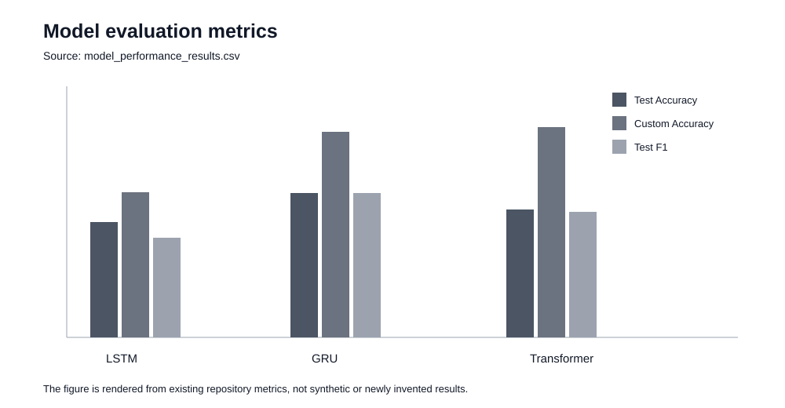

# Market Prediction Research

금융 시계열 데이터를 수집·전처리하고 LSTM, GRU, Transformer를 비교한 학사 연구 저장소입니다. 이 저장소는 결과 숫자만 제시하기보다 **데이터 수집 → 전처리 → 라벨링 → 모델 학습 → 지표 비교 → 한계 분석**의 연구 흐름을 다시 확인할 수 있도록 정리합니다.

> 이 README는 기존 논문과 실험 결과를 설명하기 위한 문서입니다. 원본 논문, 노트북, 모델 파일의 연구 결과 자체는 변경하지 않았습니다.

## 1. Research question

금융시장 시계열에서 서로 다른 sequence model이 동일한 문제를 어떻게 학습하고, 평가 지표에 따라 어떤 차이를 보이는지 비교했습니다.

원본 데이터 수집 노트북은 `yfinance`를 사용해 BTC-USD와 여러 시장 ETF의 OHLCV 데이터를 수집합니다. 저장소에는 SPY, QQQ, DIA, IWM, EFA, EEM, XLK, XLF, XLE, IAU, BTC 관련 train/test 데이터가 포함되어 있습니다.

```text
Market data
   |
   v
OHLCV collection
   |
   v
Preprocessing / indicators
   |
   v
Label construction
   |
   +--------+--------+
   |        |        |
  LSTM     GRU   Transformer
   |        |        |
   +--------+--------+
            |
            v
     Evaluation metrics
```

## 2. Repository evidence

### Data collection

`1.data.ipynb`에서 다음 시장 데이터를 수집하는 코드와 실행 기록을 확인할 수 있습니다.

- SPY
- QQQ
- DIA
- IWM
- EFA
- EEM
- XLK
- XLF
- XLE
- BTC-USD
- IAU

수집 기간과 파일 저장 로직 역시 노트북에 남아 있어 원본 데이터 생성 과정을 추적할 수 있습니다.

### Model artifacts

저장소에는 다음 모델 실험 노트북과 저장 모델이 존재합니다.

- `5-0.lstm.ipynb`
- `6-0.gru.ipynb`
- `7-0.transformer.ipynb`
- `LSTM_model.h5`
- `GRU_model.h5`
- `Transformer_model.keras`

### Evaluation table

`model_performance_results.csv`는 세 모델의 동일한 비교 지표를 보관합니다.

| Model | Test Loss | Test Accuracy | Custom Accuracy | Test F1 |
|---|---:|---:|---:|---:|
| LSTM | 1.4929 | 0.2979 | 0.3750 | 0.2574 |
| GRU | 1.5055 | **0.3739** | 0.5321 | **0.3730** |
| Transformer | **1.1344** | 0.3313 | **0.5440** | 0.3260 |



## 3. What the metrics say

한 모델이 모든 지표에서 우세하지 않았습니다.

- **GRU**: Test Accuracy와 Test F1이 가장 높음
- **Transformer**: Test Loss가 가장 낮고 Custom Accuracy가 가장 높음
- **LSTM**: 세 모델 중 해당 표의 주요 지표에서 우세하지 않음

따라서 이 결과를 “Transformer가 가장 좋다” 또는 “GRU가 가장 좋다”로 단순화하지 않습니다. 실제 모델 선택에서는 **최적화하려는 평가 기준과 오류 비용**을 먼저 정해야 합니다.

이 관점은 이후 백엔드 성능 평가에서도 동일하게 적용했습니다. 평균 latency 하나가 아니라 p95/p99, throughput, error rate를 함께 보는 이유와 연결됩니다.

## 4. Research pipeline

### 4.1 Collection

`yfinance`를 이용해 시장별 OHLCV를 동일한 기간 기준으로 수집합니다.

### 4.2 Preprocessing

탐색 노트북에서 가격 컬럼 정규화 및 기술 지표 생성 과정을 시도했습니다. 원본 notebook output에는 탐색 과정에서 발생한 예외 기록도 남아 있습니다. 이는 최종 결과가 아니라 **연구 개발 중 실패와 수정 흔적**으로 유지합니다.

### 4.3 Labeling

라벨링 노트북을 통해 모델 학습에 필요한 target을 생성하는 과정을 분리했습니다.

### 4.4 Model comparison

동일 데이터 흐름에서 LSTM, GRU, Transformer를 각각 학습하고 공통 결과 파일에 지표를 모았습니다.

## 5. Reproducibility policy

이 저장소의 기존 노트북은 연구 당시의 실행 기록을 보존하기 때문에 일부 셀에 탐색 중 발생한 traceback이 포함될 수 있습니다. 포트폴리오에서는 이를 숨기기보다 다음처럼 구분합니다.

```text
Original notebooks  -> historical experiment evidence
model_performance_results.csv -> canonical reported comparison
scripts/plot_model_results.py -> reproducible report visualization
README / docs -> cleaned interpretation layer
```

새로운 성능 수치를 재실험하지 않고 기존 연구 수치를 변경하지 않습니다.

## 6. Visualization reproduction

```bash
pip install -r requirements-report.txt
python scripts/plot_model_results.py
```

스크립트는 `model_performance_results.csv`만 읽고 모델 비교 그래프를 생성합니다.

## 7. Project structure

```text
.
├── 1.data.ipynb
├── 2.preprocessing.ipynb
├── 3.labeled.ipynb
├── 4.standard.ipynb
├── 5-0.lstm.ipynb
├── 6-0.gru.ipynb
├── 7-0.transformer.ipynb
├── *_Train.csv / *_Test.csv
├── LSTM_model.h5
├── GRU_model.h5
├── Transformer_model.keras
├── model_performance_results.csv
├── scripts/
│   └── plot_model_results.py
└── docs/
    ├── REPRODUCIBILITY.md
    ├── MODEL_EVALUATION.md
    └── assets/model_metrics.svg
```

## 8. Engineering lessons carried forward

이 연구는 현재 백엔드 프로젝트와 직접 같은 종류의 프로젝트는 아니지만 다음 습관의 출발점이 되었습니다.

1. **한 지표만으로 결론 내리지 않기**
2. **원본 데이터와 파생 결과를 분리하기**
3. **실험 실패 기록과 최종 결과를 구분하기**
4. **재현 가능한 입력과 평가 파일을 남기기**
5. **모델/기술 선택을 문제의 평가 기준과 연결하기**

## 9. Interview discussion points

- 왜 여러 시장 ETF를 함께 수집했는가?
- LSTM, GRU, Transformer의 시계열 처리 차이는 무엇인가?
- Accuracy와 F1이 다른 결론을 줄 수 있는 이유는 무엇인가?
- validation 성능과 train 성능이 벌어질 때 무엇을 의심해야 하는가?
- 연구 notebook과 재현 가능한 production pipeline은 어떤 점이 다른가?
- 이후 동일 연구를 다시 한다면 data leakage와 time-series split을 어떻게 더 엄격하게 관리할 것인가?

## 10. Limitations

이 저장소는 학사 연구 당시의 코드와 데이터를 보존하는 것이 목적이므로 production ML pipeline으로 포장하지 않습니다. 탐색 노트북에는 연구 과정의 시행착오가 남아 있고, 현재 프로젝트에서는 이를 근거로 **재현성과 평가 설계를 개선해야 할 지점**까지 명시합니다.

원문 연구 내용은 저장소의 학사학위논문 PDF에서 확인할 수 있습니다.
