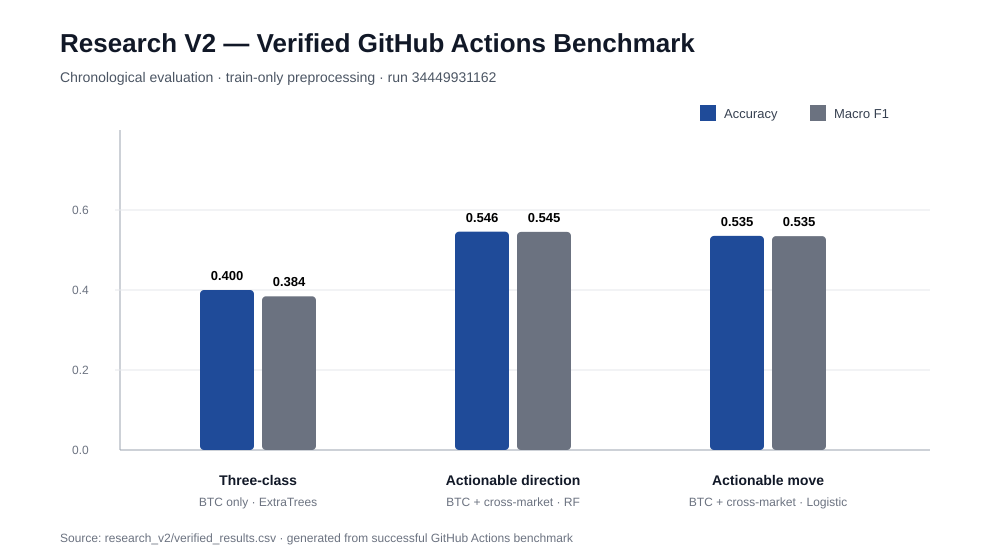

# Market Prediction Research

Bitcoin과 전통 금융시장 데이터를 이용해 **시계열 방향 예측 문제를 설계하고, 평가 프로토콜의 한계를 다시 점검한 뒤 leakage-safe benchmark와 cross-market 실험으로 재검증한 연구 프로젝트**입니다.

이 저장소는 학사 연구 당시의 LSTM/GRU/Transformer 실험을 보존하면서, 결과를 더 좋아 보이게 만들기 위해 숫자를 수정하는 대신 **왜 기존 결과를 그대로 신뢰하기 어려운지 진단하고 평가 설계를 개선한 과정**까지 함께 기록합니다.

> 핵심 메시지: 모델 구조보다 먼저 **데이터 분할, preprocessing boundary, baseline, metric, confidence와 coverage**가 연구 결론을 결정합니다.

---

## 1. Executive Summary

초기 연구는 BTC 가격/기술지표와 여러 시장 데이터를 수집하고 LSTM, GRU, Transformer를 비교했습니다.

원래 보고된 주요 결과는 다음과 같습니다.

| Model | Test Loss | Test Accuracy | Custom Accuracy | Test F1 |
|---|---:|---:|---:|---:|
| LSTM | 1.4929 | 0.2979 | 0.3750 | 0.2574 |
| GRU | 1.5055 | **0.3739** | 0.5321 | **0.3730** |
| Transformer | **1.1344** | 0.3313 | **0.5440** | 0.3260 |

이 표만 보면 GRU의 Accuracy/F1이 가장 높고 Transformer의 Loss/Custom Accuracy가 가장 높습니다. 그러나 포트폴리오 정리 과정에서 원본 preprocessing과 split을 다시 점검한 결과, **전체 데이터에 scaler를 fit한 뒤 random train/test split을 사용하는 평가 경로**가 확인됐습니다.

금융 시계열에서는 미래 구간의 분포 정보가 preprocessing에 들어가거나 시간 순서가 섞이면 실제 배포 환경보다 낙관적인 평가가 될 수 있습니다.

그래서 Research V2에서는 다음 원칙으로 다시 실험했습니다.

```text
Original experiment
      │
      ▼
Evaluation audit
      │
      ├─ global scaler fit 발견
      └─ random temporal split 발견
      │
      ▼
Chronological split
      │
      ▼
Train-only preprocessing
      │
      ▼
Dummy baseline
      │
      ▼
Model / feature validation
      │
      ▼
Final test once
      │
      ├─ walk-forward stability
      ├─ cross-market ablation
      └─ selective prediction
```

---

## 2. Research Questions

연구 질문을 하나의 "Bitcoin을 맞힐 수 있는가?"로 두지 않고 네 단계로 분리했습니다.

### RQ1. Sequence model은 동일 3-class 문제에서 어떤 차이를 보이는가?

원래 연구의 LSTM / GRU / Transformer 비교입니다.

### RQ2. 시간 순서를 보존한 더 엄격한 평가에서도 dummy baseline보다 유의미한 signal을 찾을 수 있는가?

Research V2의 핵심 질문입니다.

### RQ3. BTC 자체 feature와 ETF/Gold 등 cross-market feature는 어떤 task에서 도움이 되는가?

"외부 데이터를 많이 넣으면 좋아진다"는 가설을 실제 ablation으로 확인합니다.

### RQ4. 모든 날짜를 강제로 예측하는 대신 confidence가 높은 경우만 예측하면 quality/coverage trade-off가 어떻게 바뀌는가?

Selective prediction 실험입니다.

---

## 3. Data

저장소에는 BTC와 다양한 전통시장 자산의 OHLCV 데이터가 포함돼 있습니다.

- BTC-USD
- SPY
- QQQ
- DIA
- IWM
- EFA
- EEM
- XLK
- XLF
- XLE
- IAU

BTC labeled dataset에는 Date, OHLCV, 기술 지표, return, 3-class label이 남아 있어 기존 연구와 새 benchmark를 같은 repository evidence에서 재현할 수 있습니다.

```text
BTC market data
      │
      ├─ price / volume
      ├─ technical indicators
      └─ target label

Cross-market data
      │
      ├─ broad equity ETF
      ├─ small-cap / emerging market
      ├─ sector ETF
      └─ gold proxy
```

---

## 4. Original Study

### 4.1 Pipeline

```text
Market collection
    ↓
Preprocessing
    ↓
Labeling
    ↓
Scaling
    ↓
LSTM / GRU / Transformer
    ↓
Accuracy / F1 / Custom Accuracy / Loss
```

원본 연구 자산은 다음 파일로 보존합니다.

- `1.data.ipynb`
- `2.preprocessing.ipynb`
- `3.labeled.ipynb`
- `4.standard.ipynb`
- `5-0.lstm.ipynb`
- `6-0.gru.ipynb`
- `7-0.transformer.ipynb`
- `LSTM_model.h5`
- `GRU_model.h5`
- `Transformer_model.keras`
- `model_performance_results.csv`

원본 결과를 지우지 않은 이유는 **연구 당시 결과와 이후 평가 개선을 구분하기 위해서**입니다.

---

## 5. Evaluation Audit

포트폴리오 정리 과정에서 가장 중요한 작업은 모델을 추가한 것이 아니라 기존 실험을 다시 읽은 것입니다.

### Problem 1. Preprocessing leakage risk

원본 표준화 단계는 전체 데이터에 scaler를 fit한 후 dataset을 나누는 흐름을 사용했습니다.

```text
All data
   ↓ fit scaler
Scaled all data
   ↓ random split
Train / Test
```

이 구조에서는 test 구간의 분포 정보가 scaler parameter에 반영될 수 있습니다.

### Problem 2. Random split for temporal data

금융 시계열의 실제 사용 시점은 항상:

```text
Past → Future
```

입니다.

random split은 미래와 과거를 섞어 train/test를 구성하므로 production-like evaluation과 다릅니다.

### Revised rule

```text
Time ordered data
      ↓
Train 60%
Validation 20%
Test 20%
      ↓
fit preprocessing on TRAIN only
      ↓
model selection on validation
      ↓
final evaluation on test once
```

이 변경 때문에 **원래 Test Accuracy와 Research V2 Test Accuracy를 동일 조건의 before/after처럼 직접 비교하지 않습니다.**

---

## 6. Research V2 Protocol

### 6.1 Baseline first

복잡한 모델의 수치만 보는 대신 majority dummy를 반드시 같이 평가합니다.

이유:

```text
Accuracy 40%
```

라는 숫자 하나만으로는 class imbalance가 있는 문제에서 실제 signal이 있는지 알 수 없습니다.

따라서 함께 봅니다.

- Accuracy
- Balanced Accuracy
- Macro F1
- Dummy Accuracy
- Dummy Macro F1
- Confusion Matrix
- Walk-forward mean/std

### 6.2 Model families

Research V2는 복잡한 deep model만 고집하지 않습니다.

- Logistic Regression
- Random Forest
- Extra Trees
- HistGradientBoosting
- Dummy baseline

목적은 "가장 복잡한 모델이 최고"를 증명하는 것이 아니라 **현재 feature에서 어떤 inductive bias가 validation에 더 잘 맞는지 확인하는 것**입니다.

### 6.3 Feature sets

- BTC-only stationary feature
- BTC + cross-market feature

가격 level 자체보다 return, rolling change 등 시간축에서 더 안정적인 feature를 중심으로 사용합니다.

---

## 7. Verified GitHub Actions Results

아래 수치는 저장소의 실제 데이터를 GitHub Actions에서 실행한 결과입니다.

- Workflow: `research-v2`
- Successful run: `34449931162`
- Evaluated commit: `d81f044c91f41e65ff1e4758b530033067e2d1b9`
- Python: 3.11
- Full result record: [`research_v2/VERIFIED_RESULTS.md`](research_v2/VERIFIED_RESULTS.md)
- Machine-readable table: [`research_v2/verified_results.csv`](research_v2/verified_results.csv)



### 7.1 Three-class direction prediction

Best verified configuration:

| Item | Value |
|---|---|
| Feature | BTC only |
| Model | ExtraTrees |
| Test Accuracy | **0.4000** |
| Balanced Accuracy | **0.3875** |
| Macro F1 | **0.3844** |
| Dummy Accuracy | 0.2930 |
| Dummy Macro F1 | 0.1511 |

Dummy 대비 gain:

- Accuracy: **+0.1070**
- Balanced Accuracy: **+0.0542**
- Macro F1: **+0.2333**

이 결과를 "원래 GRU보다 2.61%p 개선"이라고 주장하지 않습니다. **평가 protocol이 다르기 때문**입니다.

더 중요한 결론은 leakage-safe temporal evaluation에서도 dummy보다 높은 결과를 재현했다는 점입니다.

---

## 8. Cross-market Ablation

외부 시장 feature가 항상 예측력을 높이는지 확인했습니다.

### Three-class

| Feature | Accuracy | Balanced Acc. | Macro F1 |
|---|---:|---:|---:|
| BTC only | **0.4000** | **0.3875** | **0.3844** |
| BTC + cross-market | 0.3859 | 0.3785 | 0.3772 |

3-class에서는 cross-market feature 추가가 개선으로 이어지지 않았습니다.

따라서:

> "ETF 데이터를 추가했더니 성능이 좋아졌다"

라고 결론 내리지 않습니다.

### Actionable direction

±1% 이상 움직인 날짜만 대상으로 상승/하락 방향을 분류하면 결과가 달라졌습니다.

| Feature | Model | Accuracy | Balanced Acc. | Macro F1 |
|---|---|---:|---:|---:|
| BTC only | RandomForest | 0.5197 | 0.5189 | 0.5189 |
| BTC + cross-market | RandomForest | **0.5459** | **0.5482** | **0.5451** |

이 task에서는 cross-market feature가 도움이 됐습니다.

### Interpretation

feature의 가치는 절대적이지 않았습니다.

```text
All-day three-class
→ BTC-only가 더 좋음

Large-move direction
→ cross-market가 더 좋음
```

따라서 **feature engineering은 task definition과 함께 평가해야 한다**는 결론을 얻었습니다.

---

## 9. Actionable Move Experiment

다음 질문은 방향 자체보다:

> "내일 의미 있는 크기의 움직임이 발생할 것인가?"

입니다.

BTC + cross-market Logistic model:

- Accuracy: `0.5352`
- Balanced Accuracy: `0.5693`
- Macro F1: `0.5347`
- ROC AUC: `0.5718`

majority dummy accuracy는 더 높았지만 class imbalance 때문에 Balanced Accuracy와 Macro F1은 모델이 더 높았습니다.

이 사례는 **Accuracy 하나만 보면 모델 선택을 잘못할 수 있는 이유**를 보여줍니다.

---

## 10. Selective Prediction

금융 예측에서 모델이 모든 날에 행동해야 한다는 가정 자체를 다시 검토했습니다.

```text
Low confidence
→ abstain

High confidence
→ prediction
```

첫 strict 3-class benchmark에서는:

- threshold: `0.65`
- coverage: `31.93%`
- accuracy: `42.11%`

를 기록했습니다.

Extended binary experiment의 가장 높은 selective slice는:

### BTC-only actionable move

- confidence threshold: `0.65`
- coverage: `23.10%`
- accuracy: **64.63%**
- balanced accuracy: **64.94%**
- macro F1: **64.20%**

이 결과도 전체 test accuracy와 같은 의미는 아닙니다. 전체의 약 23%만 선택하기 때문에 coverage를 반드시 같이 제시합니다.

핵심 해석:

> **예측을 포기할 수 있는 시스템에서는 accuracy만 최대화할 것이 아니라 prediction quality와 coverage 사이의 trade-off를 설계해야 한다.**

---

## 11. Walk-forward Stability

단일 test split이 우연히 잘 맞았는지 확인하기 위해 walk-forward 평가를 추가했습니다.

첫 leakage-safe benchmark:

```text
Macro F1 mean = 0.3485
Macro F1 std  = 0.0198
```

최고 점수 하나보다 fold 간 변동성을 보는 이유는 금융시장 regime이 시간에 따라 변하기 때문입니다.

실제 production model이라면 여기에:

- rolling retrain interval
- drift monitoring
- transaction cost
- confidence calibration
- regime별 성능

까지 추가로 검증해야 합니다.

---

## 12. Why These Metrics?

### Accuracy

직관적이지만 class imbalance에 취약합니다.

### Balanced Accuracy

각 class recall을 균등하게 반영해 특정 class 편향을 줄여 봅니다.

### Macro F1

각 class F1을 동일 가중으로 평균하므로 minority class 예측을 함께 평가할 수 있습니다.

### ROC AUC

binary task에서 threshold-independent ranking quality를 보조적으로 확인합니다.

### Coverage

selective prediction에서 몇 %의 표본에 실제 예측을 내렸는지 나타냅니다.

```text
Accuracy ↑
Coverage ↓
```

가 가능하므로 둘을 반드시 함께 봅니다.

---

## 13. What Actually Improved?

이 프로젝트에서 가장 큰 개선은 모델 parameter가 아닙니다.

### Before

```text
Deep model comparison
→ reported metric
→ best model 선택
```

### After

```text
Evaluation audit
→ leakage risk 발견
→ temporal split
→ train-only preprocessing
→ dummy baseline
→ multiple metrics
→ cross-market ablation
→ walk-forward
→ selective prediction
→ CI reproduction
```

따라서 Research V2의 성과는 **좋은 결과만 선택하는 연구에서, 결과가 왜 나왔는지 반증 가능한 형태로 검증하는 연구로 바꾼 것**입니다.

---

## 14. Reproducibility

### Install

```bash
pip install -r requirements-research-v2.txt
```

### Leakage-safe benchmark

```bash
python research_v2/run_research.py
```

### Extended benchmark

```bash
python research_v2/run_extended_research.py
```

### CI

`.github/workflows/research-v2.yml`이 main 변경 시 두 experiment를 실행하고 result artifact를 생성합니다.

```text
compile
→ strict temporal benchmark
→ extended cross-market benchmark
→ upload results
```

---

## 15. Repository Structure

```text
.
├── 1.data.ipynb
├── 2.preprocessing.ipynb
├── 3.labeled.ipynb
├── 4.standard.ipynb
├── 5-0.lstm.ipynb
├── 6-0.gru.ipynb
├── 7-0.transformer.ipynb
│
├── 1.used_data/
├── 3.Labeled_data/
│
├── model_performance_results.csv
├── LSTM_model.h5
├── GRU_model.h5
├── Transformer_model.keras
│
├── research_v2/
│   ├── run_research.py
│   ├── run_extended_research.py
│   ├── verified_results.csv
│   └── VERIFIED_RESULTS.md
│
├── scripts/
│   └── plot_model_results.py
│
├── docs/
│   ├── REPRODUCIBILITY.md
│   ├── MODEL_EVALUATION.md
│   ├── RESEARCH_DECISIONS.md
│   ├── INTERVIEW_GUIDE.md
│   └── assets/
│       ├── model_metrics.svg
│       └── research_v2_verified.svg
│
└── .github/workflows/research-v2.yml
```

---

## 16. Research Decisions

### Why not keep tuning the GRU?

원래 GRU가 가장 높은 Test Accuracy를 기록했지만 evaluation protocol이 먼저 개선되어야 했습니다. leakage 가능성이 있는 평가에서 hyperparameter tuning을 더 하는 것은 신뢰도 문제를 해결하지 못합니다.

### Why include simple tree models?

복잡한 sequence model이 항상 더 좋은 것은 아닙니다. engineered tabular feature에서는 tree ensemble이 더 적합할 수 있으므로 complexity 자체를 성능의 근거로 삼지 않았습니다.

### Why keep failed cross-market hypothesis?

3-class에서 cross-market이 오히려 떨어졌다는 결과를 삭제하지 않습니다. 실패한 가설도 feature value가 task-dependent하다는 근거입니다.

---

## 17. Limitations

현재 결과를 실제 투자 전략 수익률로 해석하면 안 됩니다.

- transaction cost 미반영
- slippage 미반영
- market impact 미반영
- probability calibration 제한적
- regime shift 대응 모델 미구현
- 외부 데이터 publication delay 검증 필요
- prediction accuracy와 trading profitability는 동일하지 않음

실제 투자 시스템으로 확장한다면 **prediction metric → strategy rule → backtest → cost-aware return → risk metric** 단계가 추가되어야 합니다.

---

## 18. Interview Topics

- 금융 시계열에서 random split이 위험한 이유는?
- scaler를 train에만 fit해야 하는 이유는?
- Accuracy와 Balanced Accuracy가 다른 결론을 주는 이유는?
- Dummy baseline이 왜 필요한가?
- 기존 GRU 37.39%와 새 ExtraTrees 40.00%를 직접 비교하면 안 되는 이유는?
- cross-market feature가 task별로 다른 결과를 보인 이유를 어떻게 해석하는가?
- selective prediction에서 coverage를 반드시 같이 봐야 하는 이유는?
- walk-forward validation은 무엇을 검증하는가?
- 예측 성능과 실제 trading performance의 차이는?

상세 답변은 [`docs/INTERVIEW_GUIDE.md`](docs/INTERVIEW_GUIDE.md)에 정리합니다.

---

## 19. Conclusion

이 연구의 결론은 "Bitcoin을 높은 정확도로 예측했다"가 아닙니다.

더 중요한 결론은 다음과 같습니다.

1. 시계열 평가에서 temporal integrity가 모델 architecture보다 먼저다.
2. dummy baseline 없이 accuracy를 해석하면 모델의 실제 가치를 오판할 수 있다.
3. cross-market feature의 유효성은 task에 따라 달랐다.
4. 모든 날짜를 강제로 예측하지 않는 selective prediction이 의미 있는 품질/coverage trade-off를 만들었다.
5. 연구 결과를 포트폴리오화할 때 가장 중요한 것은 숫자를 좋게 바꾸는 것이 아니라 **실험을 다시 실행해도 같은 결론에 도달할 수 있게 만드는 것**이다.

**Original study의 시행착오까지 숨기지 않고, 더 엄격한 검증으로 연구를 다시 설계한 것이 이 저장소의 최종 결과입니다.**
